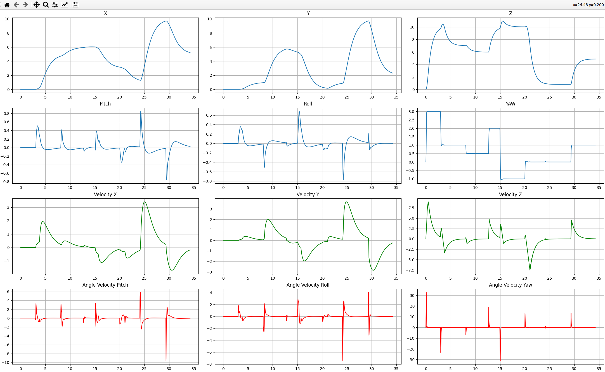

# Pitch-PID-controller
## Задача: реализовать систему стабилизации углового положения ЛА мультироторного типа на основе 2 каскадных ПИД-регуляторов, коэффициенты которых необходимо настроить.
## Программа состоит из длинамической модели, описывающей ЛА, двух каскадных ПИД-регуляторов (для углового положения и угловой скорости), заставляющих аппарат отклоняться на угол(в данной задаче 30 градусов = 0.52 радиан), симулятора, запускающего процесс стабилизации на определенный отрезок времени. 
### Графики изменений углового положения, угловой скорости, углового ускорения. Из графиков видно, что переходный процесс установления угла = 0.52 радиан занимает меньше 1 секунды. 

# UAV-simulator
## Задача: Запрограммировать математическую модель БЛА в виде функции правых частей в форме Коши (для дальнейшего численного решения системы дифференциальных уравнений модели мультикоптера), для выбранной математической модели реализована система управления с использованием 12 каскадных ПИД-регуляторов в качестве системы регулирования, разработан класс симулятора, который отвечает за вызов методов для расчёта управляющих воздействий, правых частей нашей математической модели и отправку сообщений для визуализации результата.
### MathModel.py содержит математическую реализацию дрона
### constants.py содержит все физические данные модели дрона
### controller.py содержит класс ПИД-регулятора и системы управления для всего БЛА ввиде 12 каскадных пидов
### simulator.py содержит класс симулятора БЛА, который осуществляет подключение к UDP порту, для передачи вектора состояния БЛА, осуществляет вычисление управляющего воздействия, по этому управляющему воздействию осуществляет пересчет значений математической модели
### main.py - участок программы, в котором создаются классы контроллера, математической модели, симулятора, которые необходимы для симуляции работы БЛА. Также выставляются коэффициенты 12 ПИД-регуляторов, задается миссия в виде набора точек.
## Тестирование работы программы происходило на симуляторе в папке scripts/vizualizer.py.
### График изменения состояния БЛА по всем координатам в ходе полета по точкам [0,0,10,3],[0,0,10,1],[5,1,7,1],[6,6,6,0.5],[6,5,10,2],[3,0,10,-1],[1,1,1,0],[10,10,1,0],[5,2,5,1]

### Видео работы: https://drive.google.com/file/d/1uK8oWkgHODc29t3avhAko8V5KXbvPtUL/view?usp=sharing

# task5 
## Задача: реализовать полет дрона iris по окружности в среде имитационного моделирования gazebo. Один из модулей должен формировать точки окружности и публиковать их в свой топик, а другой топик должен получать эти точки из топика, на основе П-регулятора высчитывать управляющее воздействие по линейной скорости и передавать его на БЛА. В ходе работы было разработано несколько модулей. 
### Модуль uav_circle_fly_example высчитывает необходимые координаты для полета по точкам, заполняет сообщение типа geometry_msgs::PoseStamped и публикует в топик /vehicle/desPose
### Модуль uav_controller реализует прямую работу с mavros. Выполняет инициализацию всех subscriber и publisher. 
#### Модуль подписывается на топики 
--* /mavros/state, чтобы получать информацию о состоянии БЛА, необходимую для проверки, установлено ли соединение, установления режима OFFBOARD, выполнения команды arm
--* /mavros/local_position/pose, для получения информации о текущем положении БЛА
--* /vehicle/desPose, для получения информации о целевой точки, которую публикует модуль uav_circle_fly_example
#### Модуль публикует в топик
--*/mavros/setpoint_raw/local, публикует управляющее воздействие для БЛА с маской, указывающей, что необходимо игнорировать значения положения и углов.
#### Модуль выполняет инициализацию сервисов клиентов
--*/mavros/set_mode для отправки запросов типа mavros_msgs::SetMode в Rosservice для установления режима OFFBOARD
--*/mavros/cmd/arming для отправки запросов типа mavros_msgs::CommandBool в Rosservice для вызова команды arming.
#### Таким образом, модуль устанавливает OFFBOARD, выставляет arming, получает целовое и текущее положение, вычисляется управляющее воздействие по линейной скорости, отправляется в БЛА. Данное решение необходимо для плавного полета по точкам. Если бы БЛА летел просто по точкам, траектория была бы ступенчатя и рваная.
### Модуль uav_controller_node создает uav_controller отвечающий за полет по точкам, запускает БЛА, выполняет управление по линейной скоростью
## Видео работы: https://drive.google.com/file/d/1LWW1gdtGt-Vwmkm2b2D3dqprPCYhzr1R/view?usp=sharing