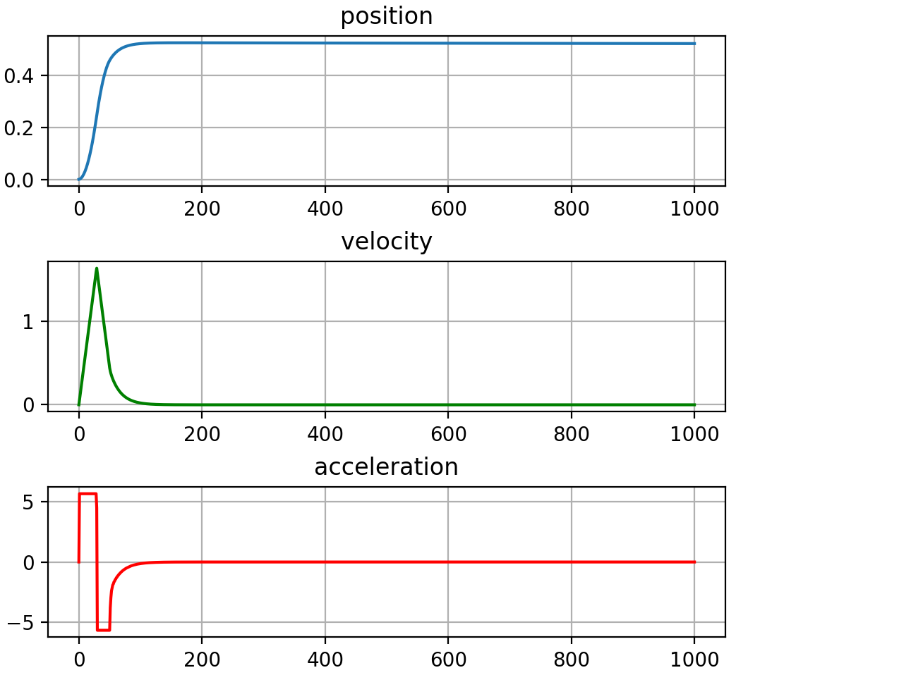

# Pitch-PID-controller
## Задача: реализовать систему стабилизации углового положения ЛА мультироторного типа на основе 2 каскадных ПИД-регуляторов, коэффициенты которых необходимо настроить.
## Программа состоит из длинамической модели, описывающей ЛА, двух каскадных ПИД-регуляторов (для углового положения и угловой скорости), заставляющих аппарат отклоняться на угол(в данной задаче 30 градусов = 0.52 радиан), симулятора, запускающего процесс стабилизации на определенный отрезок времени. 
### Графики изменений углового положения, угловой скорости, углового ускорения. Из графиков видно, что переходный процесс установления угла = 0.52 радиан занимает меньше 1 секунды. 

