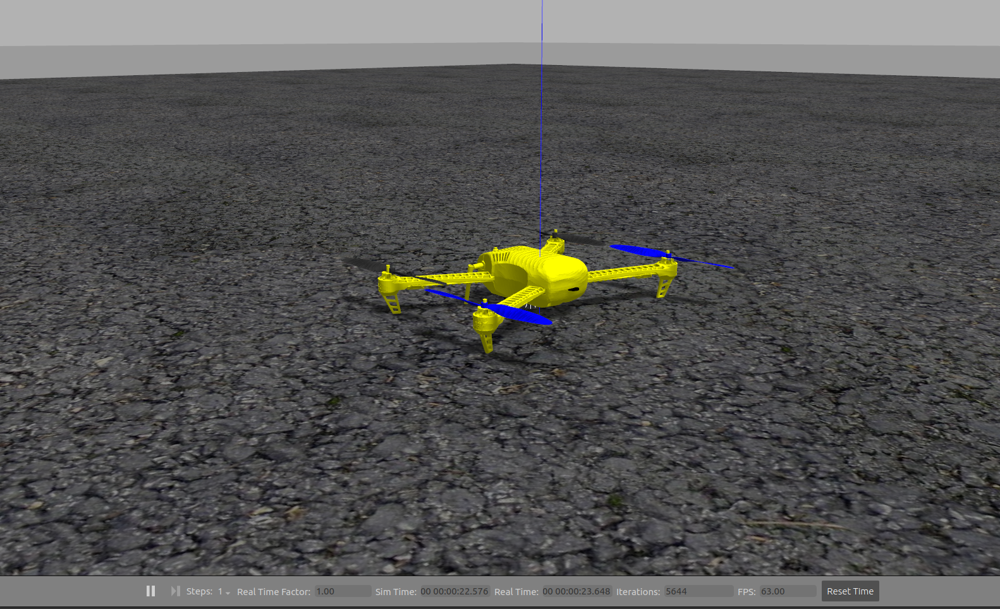

# Инструкция по выполнению Модуля 5

### Установка зависимостей:

1) ```git clone https://github.com/PX4/PX4-Autopilot.git```

2)  ```cd /home/user/path_to_px4/PX4-Autopilot/```
   
3)  ```sudo chmod +x Tools/setup/ubuntu.sh```
   
4)  ```./Tools/setup/ubuntu.sh```

---
### Далее добавьте инициализацию окружения для PX4 в ~/.bashrc файл
```
source /opt/ros/noetic/setup.bash

source /home/$USER/catkin_ws/devel/setup.bash

source /home/$USER/your_path/PX4-Autopilot/Tools/setup_gazebo.bash /home/$USER/your_path/PX4-Autopilot /home/$USER/your_path/PX4-Autopilot/build/px4_sitl_default
```
your_path - обозначение вашего пути до папки **PX4-Autopilot**.

---

### После установки зависимостей вы сможете выполнять запуск симулятора 
командой:
```roslaunch px4 mavros_posix_sitl.launch```

### В результате должен будет запуститься симулятор gazebo с аппаратом.


---

### Сборка тестовой программы для данного проекта
1) cd /home/user/your_path/uav_controller
2) mkdir build && cd build
3) cmake ..
4) make -j4


### Запуск примера
1) cd build
2) ./go_to_example


---
### Выполнение домашнего задания

Программа(Нода) **uav_circle_fly_example** Отправляет в топик **/vehicle/desPose**, координаты с целевым положением БЛА.

Ваша задача разработать программное обеспечение осуществляющего следование аппарата по заданной траектории.
Предлагается заполнить недостающие поля в файле src/uav_controller.cpp, затем подключить uav_controller.hpp в uav_controller_node.cpp
в качестве библиотеки
Требования
1) Программа должна принимать сообщения из топика **/vehicle/desPose**
2) Согласно принятым сообщениям, на основе П регулятора программа должна формировать вектор целевой скорости БЛА
3) Вектор целевой скорости БЛА программа должна отправлять в топик **/mavros/setpoint_raw/local** в формате сообщения **mavros_msgs/PositionTarget**

Пример реализации простого полета можно найти в файле examples/simple_flight_example.cpp

---
### Проверка результатов
1) Выполните запуск симулятора.
2) В папке build запустите программу **./uav_circle_fly_example**
3) Программа начнет отправлять вам координаты с целевым положением в топик **/vehicle/desPose**
4) Запустите вашу программу, например **./uav_controller_node**
5) Если аппарат движется по окружности то задание можно считать выполненным.